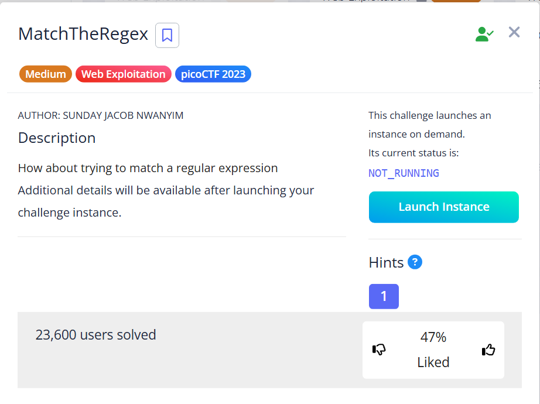
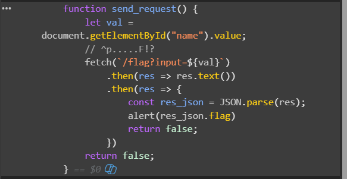

# Match The Regex

**Author:** SUNDAY JACOB NWANYIM



## Description
How about trying to match a regular expression?
Additional details will be available after launching your challenge instance.

## Hint
Access the webpage and try to match the regular expression associated with the text field.

## Solution

1.  เปิด Link โจทย์ที่ได้มา [http://saturn.picoctf.net:62963/](http://saturn.picoctf.net:62963/)
    
2.  เริ่มแรกผมลองใช้ **Burp Suite** ดักจับ Packet แต่ไม่พบข้อมูลที่น่าสนใจ จึงเปลี่ยนมาตรวจสอบ Source Code ผ่าน **Debugger** (F12) แทน
    
3.  ใน Source Code ผมพบฟังก์ชันที่น่าสนใจชื่อ `send_request` พร้อมกับ Comment ที่ดูเหมือนคำใบ้:
    
    

    ```javascript
    function send_request() {
        let val = document.getElementById("name").value;
        // ^p.....F!? ตรงนี้น่าสงสัย
        fetch(`/flag?input=${val}`)
            .then(res => res.text())
            .then(res => {
                const res_json = JSON.parse(res);
                alert(res_json.flag)
                return false;
            })
        return false;
    }
    ```

4.  เมื่อสังเกตที่ Comment `// ^p.....F!?` จะเห็นว่าเป็นรูปแบบของ **Regular Expression (RegEx)** ซึ่งใช้กำหนดรูปแบบของข้อความ (Pattern) โดยมีความหมายดังนี้:
    
    *   `^` : จุดเริ่มต้นของ String
    *   `p` : ต้องขึ้นต้นด้วยตัวอักษร **p**
    *   `.....` : ตามด้วยอักษรใดก็ได้ 5 ตัว (`.` 1 ตัว = 1 อักขระ)
    *   `F` : ตามด้วยตัวอักษร **F**
    *   `!?` : เครื่องหมาย **!** (จะมีหรือไม่ก็ได้)

5.  จากรูปแบบดังกล่าว เราสามารถสร้าง Input ที่ตรงตามเงื่อนไขได้หลายแบบ เช่น:
    *   `p12345F`
    *   `paaaaaF`
    *   `p1zx1eF`

6.  เมื่อลองกรอกข้อมูลตามรูปแบบดังกล่าวลงในช่อง Input ก็จะได้รับ Flag กลับมา
    
    `picoCTF{succ3ssfully_matchtheregex_08c310c6}`

## Summary

โจทย์ข้อนี้สอนให้ผมได้รู้ว่า Developer อาจเผลอทิ้ง Comment หรือ Logic สำคัญไว้ใน Client-side Code (เช่น JavaScript ตรวจสอบ Input) ซึ่งทำให้ผู้ใช้งานทั่วไปสามารถเปิดดูได้ การเข้าใจพื้นฐานของ **Regular Expression (RegEx)** จึงช่วยให้เราแกะรูปแบบข้อมูลที่ระบบต้องการรับได้ง่ายขึ้น และในมุมมองของผู้พัฒนา ไม่ควรทิ้งข้อมูล Sensitive หรือ Logic การตรวจสอบความปลอดภัยไว้แค่ที่หน้าบ้าน (Frontend) เพียงอย่างเดียว
