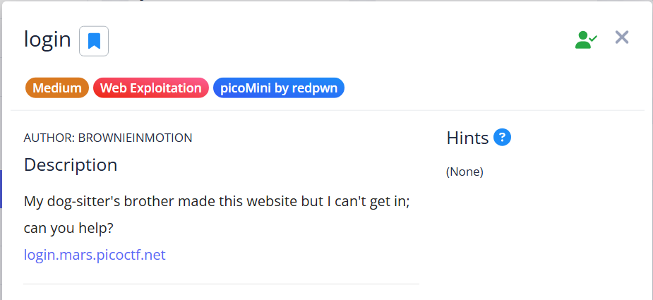
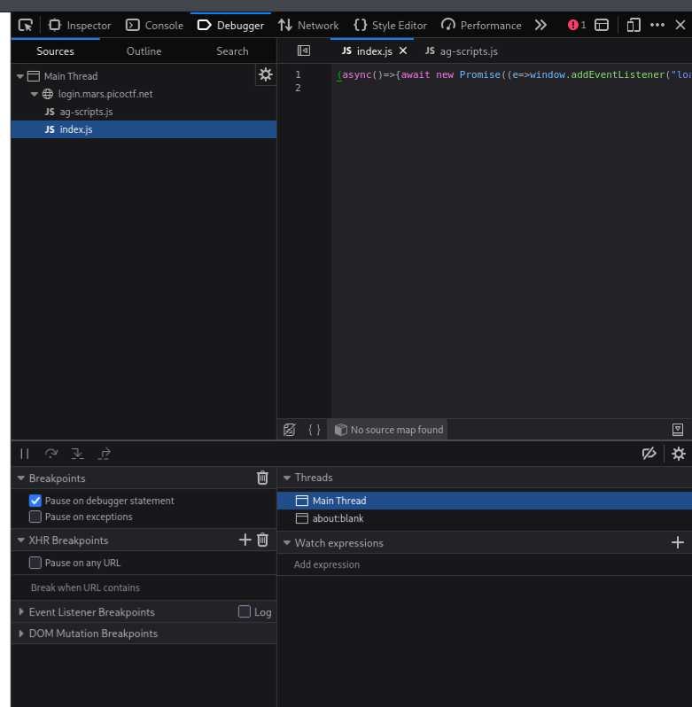
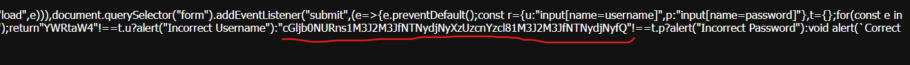
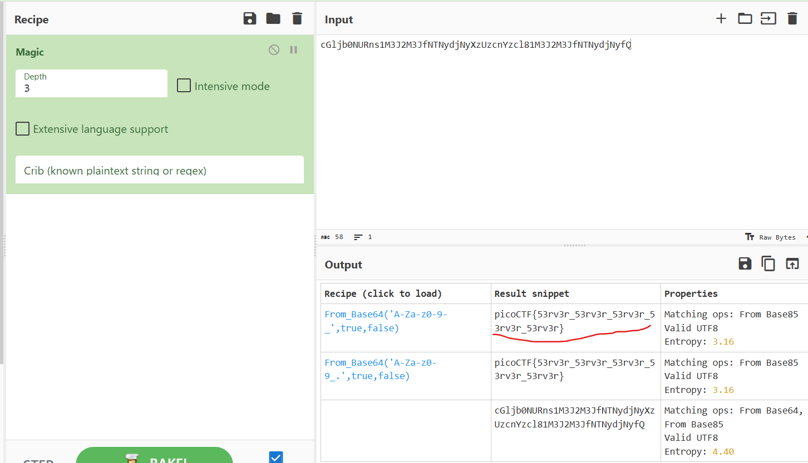

# Login Author Brownie in Motion

## Description
My dog-sitter's brother made this website but I can't get in; can you help?

## Hint
None

## Solution

1. เริ่มจากการเปิด Link ที่ให้มา [https://login.mars.picoctf.net/](https://login.mars.picoctf.net/) จะพบหน้า Login ที่ให้กรอก Username และ Password

2. ลองกรอก Username: `Admin` และ Password: `Admin` แต่ไม่สำเร็จ จึงลองทดสอบด้วย **SQL Injection** แต่ก็ยังไม่ได้ผล

3. จากนั้นลองใช้ **Burp Suite** เพื่อดักจับ Packet แต่ก็ยังไม่พบข้อมูลที่น่าสนใจ จึงเปลี่ยนไปดูในส่วนของ **Debugger** (F12) เพื่อแกะ Source Code ดู และพบจุดที่น่าสนใจ

   

4. สิ่งที่พบคือส่วนของ Code นี้:

   

5. นำ Code ที่ได้ไปถอดรหัสใน **CyberChef** ด้วยเมนู *Magic* ผลลัพธ์ที่ได้ดูเหมือนเป็น Base64 เมื่อลอง Decode ออกมาเจอกับ Flag:

   `picoCTF{53rv3r_53rv3r_53rv3r_53rv3r_53rv3r}`

   

## Summary

สรุปสิ่งที่ได้เรียนรู้: ความปลอดภัยของข้อมูลบนฝั่ง Client (Client-side Security) เป็นจุดที่ห้ามมองข้าม การนำข้อมูลที่มีความสำคัญมาไว้ใน JavaScript บนหน้าเว็บโดยตรง ทำให้ผู้ไม่หวังดีสามารถใช้ Debugger แกะซอร์สโค้ดเพื่อหาข้อมูลความลับได้ ดังนั้นข้อมูลที่สำคัญควรถูกจัดการและเก็บไว้ที่ฝั่ง Server เท่านั้นเพื่อป้องกันการถูกโจมตีจากผู้ประสงค์ร้าย