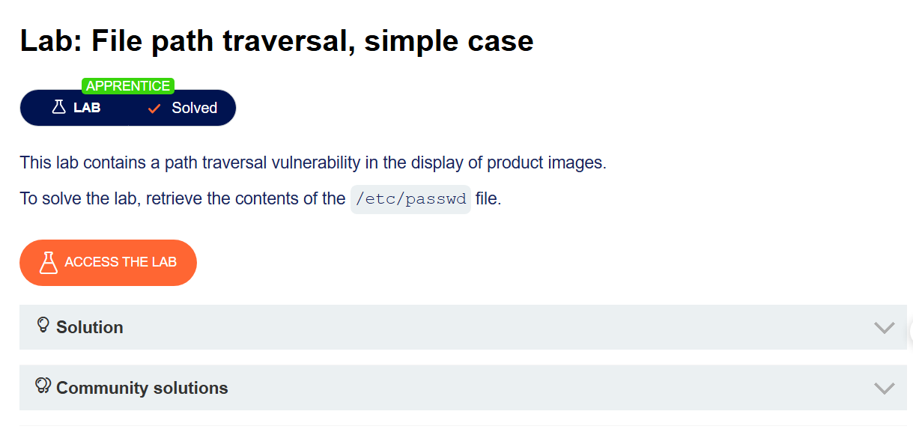
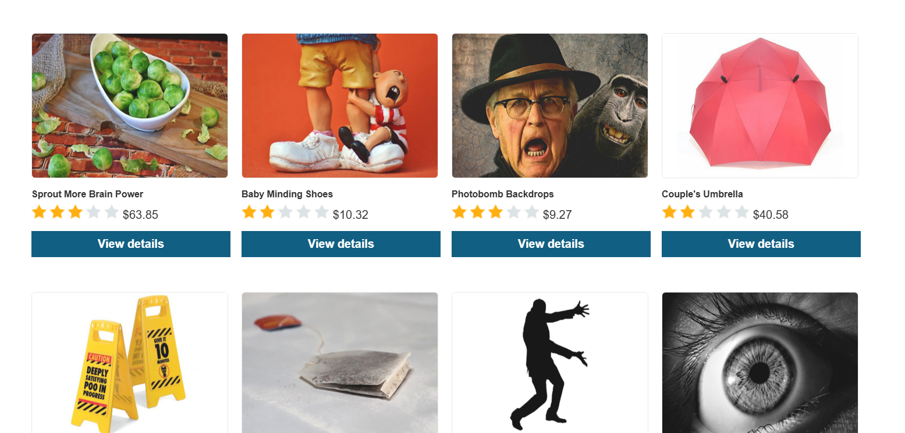
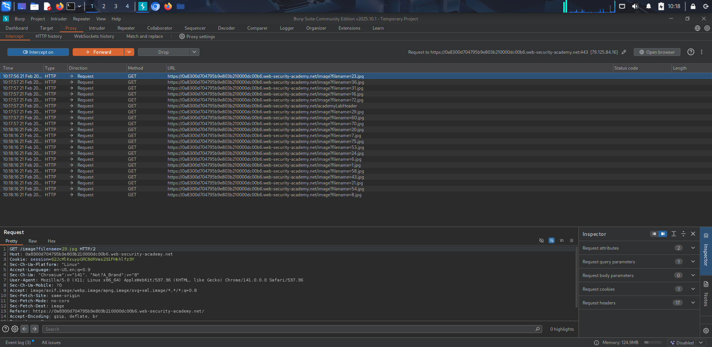
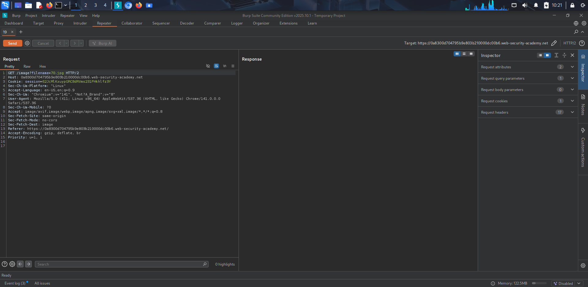
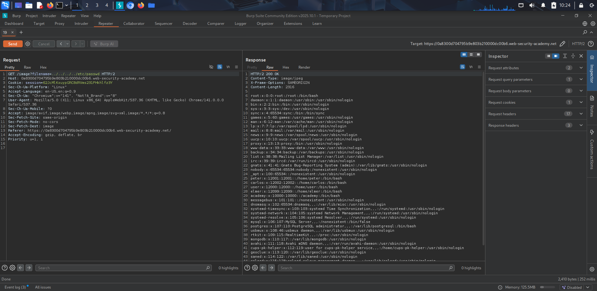

# File Path Traversal, Simple Case

**Platform:** PortSwigger Web Security Academy



## Description

This lab contains a path traversal vulnerability in the display of product images.

To solve the lab, retrieve the contents of the `/etc/passwd` file.

## Solution

1. จากเว็บไซต์ที่ได้มา ทำการสำรวจแต่ละจุด พบว่ามีไฟล์ภาพสินค้าที่โหลดผ่าน Parameter `filename` ดังรูป:

   

2. เปิด **Burp Suite** แล้วเปิด **Intercept** ในหน้า **Proxy** เพื่อดักจับ Packet จากนั้นเลือก Request `GET` ที่เป็นการโหลดไฟล์ภาพ:

   

3. คลิกขวาที่ Request แล้วส่งไปยัง **Repeater** เพื่อจะได้แก้ไขและส่ง Request ซ้ำได้สะดวก:

   

4. ใน Repeater ทำการแก้ไข Path จากเดิม:

   ```
   GET /image?filename=70.jpg
   ```

   เปลี่ยนเป็น:

   ```
   GET /image?filename=../../../../etc/passwd
   ```

   โดย `../` แต่ละตัวจะย้อนขึ้นไป 1 Directory ดังนั้น `../../../../` จะย้อนขึ้นจาก Directory ที่เก็บภาพไปจนถึง Root (`/`) ของระบบ แล้วจึงเข้าถึงไฟล์ `/etc/passwd` ได้

5. กด **Send** แล้วดูผลลัพธ์ใน Response จะพบว่าสามารถดึงเนื้อหาของไฟล์ `/etc/passwd` ออกมาได้สำเร็จ:

   

   ไฟล์ `/etc/passwd` เป็นไฟล์ในระบบ Linux/Unix ที่เก็บข้อมูลบัญชีผู้ใช้ทั้งหมดในระบบ เช่น Username, UID, GID, Home Directory และ Default Shell

## Summary

โจทย์ข้อนี้ทำให้ได้เรียนรู้เกี่ยวกับช่องโหว่ **Path Traversal (Directory Traversal)** ซึ่งเกิดจากการที่ Web Application ไม่ได้ตรวจสอบหรือกรอง Input ที่ใช้ระบุชื่อไฟล์ ทำให้ผู้โจมตีสามารถใช้ `../` เพื่อย้อน Directory และเข้าถึงไฟล์สำคัญของระบบได้ (เช่น `/etc/passwd`) วิธีป้องกันที่ถูกต้อง ได้แก่ การทำ Input Validation โดยอนุญาตเฉพาะ Whitelist Characters, การใช้ Canonicalization เพื่อแปลง Path ให้เป็นรูปแบบมาตรฐาน และการจำกัดสิทธิ์การเข้าถึงไฟล์ของ Web Server ให้อยู่ภายใน Directory ที่กำหนดเท่านั้น (Chroot/Sandbox)