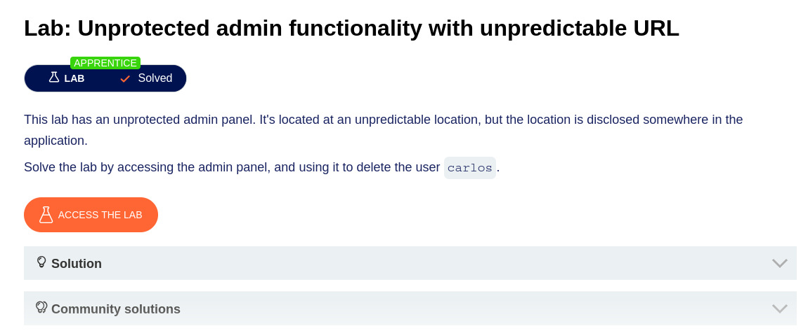
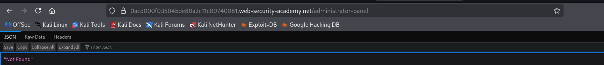
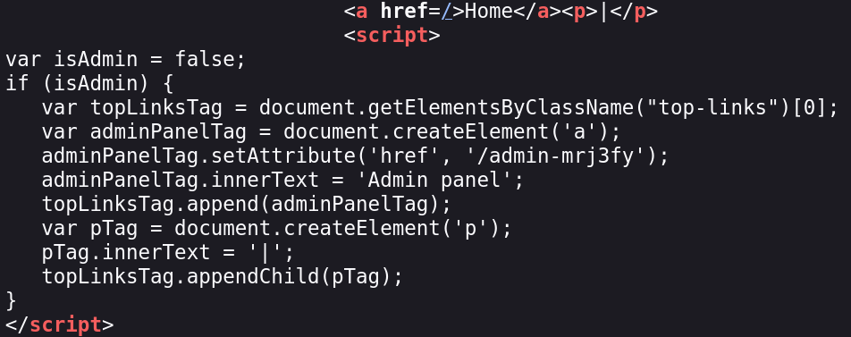
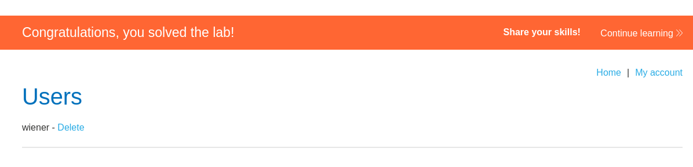

# Unprotected admin functionality with unpredictable URL

**Platform:** PortSwigger Web Security Academy



## Description

This lab has an unprotected admin panel. It's located at an unpredictable location, but the location is disclosed somewhere in the application.

Solve the lab by accessing the admin panel, and using it to delete the user `carlos`.

## Solution

1. จากหน้าเว็บที่ได้มา ผมลองใช้วิธีเดิมจากข้อก่อนหน้า ด้วยการเดา Path ที่ใช้บ่อย เช่น `/robots.txt` และ `/administrator-panel` แต่ครั้งนี้ไม่พบอะไรเลย เนื่องจากโจทย์บอกไว้ว่า URL ของ Admin Panel นั้น **unpredictable** (คาดเดาไม่ได้)

   

2. เนื่องจากโจทย์บอกใบ้ว่า "the location is **disclosed somewhere in the application**" ผมจึงลอง **View Page Source** (คลิกขวา → View Page Source หรือ `Ctrl+U`) เพื่อตรวจสอบ Source Code ของหน้าเว็บ และพบ JavaScript ที่น่าสนใจซ่อนอยู่:

   

   ```javascript
   <script>
   var isAdmin = false;
   if (isAdmin) {
      var topLinksTag = document.getElementsByClassName("top-links")[0];
      var adminPanelTag = document.createElement('a');
      adminPanelTag.setAttribute('href', '/admin-mrj3fy');
      adminPanelTag.innerText = 'Admin panel';
      topLinksTag.append(adminPanelTag);
      var pTag = document.createElement('p');
      pTag.innerText = '|';
      topLinksTag.appendChild(pTag);
   }
   </script>
   ```

   **วิเคราะห์ Code:** Script นี้ตรวจสอบว่าตัวแปร `isAdmin` เป็น `true` หรือไม่ ถ้าใช่ จะสร้างลิงก์ "Admin panel" ที่ชี้ไปยัง `/admin-mrj3fy` บนหน้าเว็บ แต่เนื่องจาก `isAdmin` ถูกตั้งค่าเป็น `false` จึงไม่แสดงลิงก์นั้นออกมา อย่างไรก็ตาม **Path ของ Admin Panel ถูกฝังไว้ใน Source Code** ซึ่งใครก็สามารถอ่านได้

3. นำ Path `/admin-mrj3fy` ที่ค้นพบไปใส่ต่อท้าย URL ปรากฏว่าสามารถเข้าสู่หน้า Admin Panel ได้ทันที **โดยไม่มีการตรวจสอบสิทธิ์ใดๆ** จากนั้นทำการลบผู้ใช้ `carlos` ตามที่โจทย์กำหนด

   

## Summary

โจทย์ข้อนี้ต่อยอดจากข้อ "Unprotected admin functionality" โดยครั้งนี้ Developer พยายามใช้ URL ที่คาดเดาไม่ได้ (`/admin-mrj3fy`) แทน URL ทั่วไปอย่าง `/admin` แต่กลับ **เปิดเผย Path ไว้ใน JavaScript บนหน้าเว็บ** ซึ่งเป็นช่องโหว่ประเภท **Information Disclosure via Client-side Code**

**บทเรียนที่ได้:**
- **Client-side Code ไม่ใช่ที่ซ่อนความลับ** — ไม่ว่าจะตั้งค่า `isAdmin = false` หรือซ่อน Logic ไว้อย่างไร ผู้ใช้ทุกคนสามารถอ่าน Source Code ฝั่ง Client ได้เสมอ
- **Security through Obscurity ไม่ใช่ทางออก** — การเปลี่ยนชื่อ URL ให้คาดเดายาก ไม่ได้ป้องกันการเข้าถึงจริง
- **ต้องมี Authentication & Authorization** — หน้า Admin ทุกหน้าต้องบังคับให้ Login และตรวจสอบว่าผู้ใช้มีสิทธิ์ระดับ Admin จริงหรือไม่ ก่อนอนุญาตให้ใช้งาน
