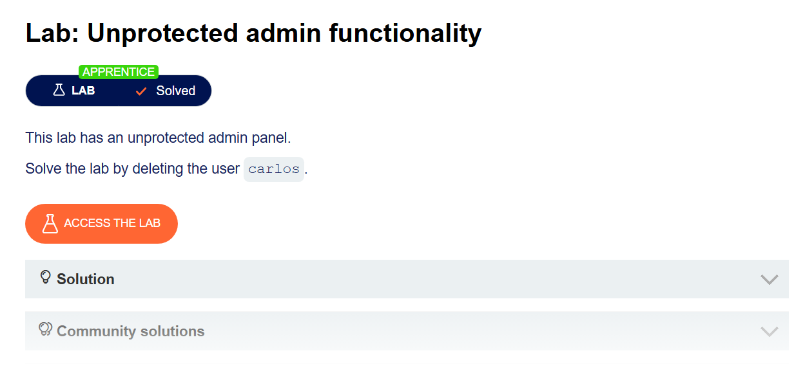
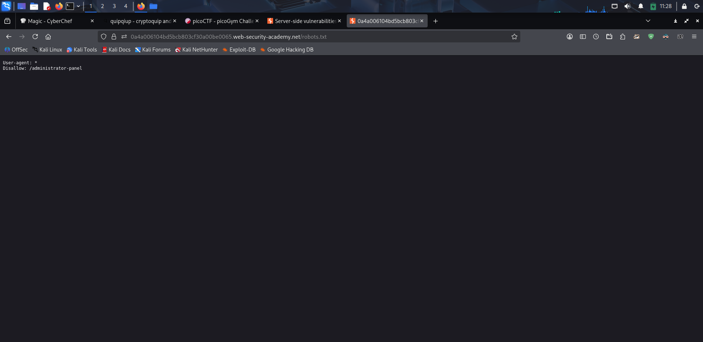
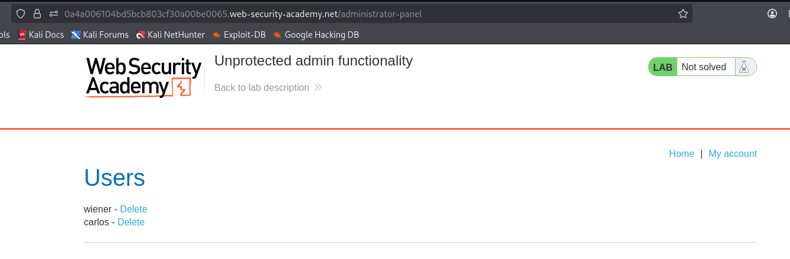
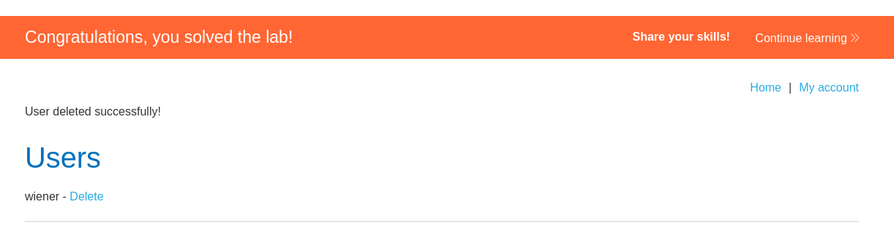

# Unprotected admin functionality

**Platform:** PortSwigger Web Security Academy



## Description

This lab has an unprotected admin panel.

Solve the lab by deleting the user `carlos`.

## Solution

1. เปิดลิ้งก์ Website จากโจทย์ที่ระบุว่ามี "unprotected admin panel" โดยทั่วไปในการทดสอบเจาะระบบ เรามักจะใช้วิธี **Forced Browsing** คือการสุ่มเดา Path ที่ใช้บ่อยๆ เช่น `/admin`, `/administrator` หรือ `/login` ผมจึงลองเข้า `/admin` ก่อน แต่ไม่พบอะไร (ได้หน้า Not Found) ดังภาพ

   

2. ต่อมา ผมได้ลองเข้าไปตรวจสอบไฟล์ `/robots.txt` ซึ่งเป็นไฟล์มาตรฐานที่ใช้บอก Web Crawler (เช่น Googlebot) ว่าโฟลเดอร์ไหนของเว็บที่อนุญาตหรือไม่อนุญาตให้เข้ามาเก็บข้อมูล ซึ่งหลายครั้ง Developer มักจะเผลอใส่ Path สำคัญๆ ไว้ในออปชัน `Disallow`

   และผลลัพธ์ก็เป็นไปตามคาด พบ Path ที่ถูกซ่อนไว้:

   

   ```text
   User-agent: *
   Disallow: /administrator-panel
   ```

3. จากนั้น ผมนำ Path ที่ได้มาเข้าถึงโดยตรง โดยพิมพ์ `/administrator-panel` ลงในช่อง URL ซึ่งปรากฏว่าเป็นหน้า Admin Panel จริงๆ และ **ไม่มีการตรวจสอบสิทธิ์ (No Authentication)** สามารถเข้าถึงระบบหลังบ้านได้ทันที

   

4. โจทย์กำหนดให้ทำการลบผู้ใช้ที่ชื่อ `carlos` ผมจึงกดลิงก์ Delete ที่แถวของผู้ใช้งานคนดังกล่าว เพื่อแก้โจทย์ให้เสร็จสิ้น

   

## Summary

โจทย์ข้อนี้สอนให้เห็นถึงความผิดพลาดของการออกแบบความปลอดภัยที่เรียกว่า **Security through Obscurity** (ความปลอดภัยโดยการปิดบัง) 

Developer คิดว่าการเปลี่ยนชื่อ URL เป็นชื่อที่คาดเดายาก (เช่น `/administrator-panel` แทน `/admin`) จะช่วยป้องกันแฮกเกอร์ได้ แต่กลับไปใส่พาธนั้นไว้ใน `/robots.txt` เพื่อกันไม่ให้ไปทำดัชนี (Index) บน Search Engine ซึ่งกลายเป็นการ "ชี้เป้า" ให้ผู้โจมตีรู้พาธเหล่านั้นแทน

**วิธีป้องกันที่ถูกต้อง:** 
ฟังก์ชันที่มีความอ่อนไหวระดับผู้ดูแลระบบ (Admin Functionality) ควรมีการทำ **Authentication** (การยืนยันตัวตน) และ **Authorization** (การตรวจสอบสิทธิ์) อย่างแน่นหนาทุกครั้งที่ถูกเรียกใช้งาน ไม่ใช่แค่ซ่อน URL ไว้เฉยๆ
